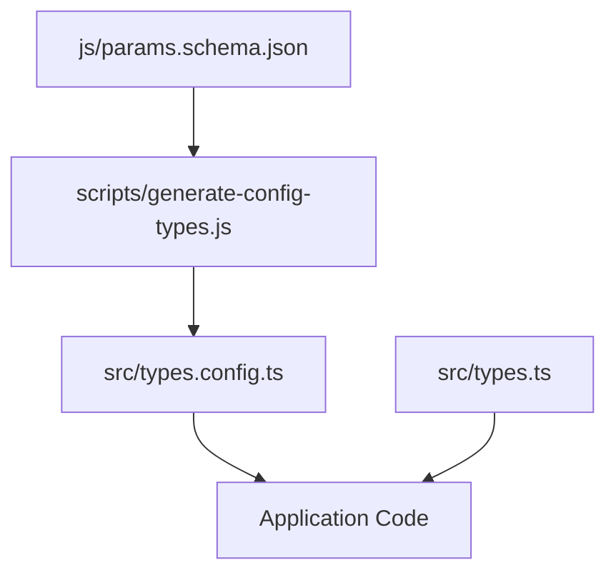

# TypeScript Interface Generation Process

This document describes the automated process for generating TypeScript interfaces from JSON schema files in the Anno 117 Calculator project.

## Overview

The project uses a two-step process to convert JSON schemas into strongly-typed TypeScript interfaces:

1. **JSON Schema Source**: `js/params.schema.json` - Contains the complete schema definition for all game parameters
2. **Generation Script**: `scripts/generate-config-types.js` - Dynamically converts the schema to TypeScript interfaces
3. **Generated Output**: `src/types.config.ts` - Contains all the TypeScript configuration interfaces

## File Structure

```
anno-117-calculator/
├── js/
│   └── params.schema.json          # Source JSON schema
├── scripts/
│   └── generate-config-types.js    # Generation script
└── src/
    ├── types.config.ts             # Generated interfaces (DO NOT EDIT MANUALLY)
    └── types.ts                    # Core application types
```

## JSON Schema Structure

The `params.schema.json` file defines the structure of all game configuration data:

### Root Properties
- `constants` - Game constants like fuel production times
- `languages` - Supported localization languages  
- `regions` - Game regions with GUID, name, icon, and localized text
- `sessions` - Game sessions with region associations
- `needAttributes` - Attributes obtained from needs (Population, Money, Happiness, etc.)
- `needCategories` - Categories for organizing needs
- `needs` - Population needs with products, categories, and attributes
- `populationGroups` - Population group definitions
- `populationLevels` - Population levels with workforce connections
- `products` - Product definitions with regional associations
- `workforce` - Workforce types with regional associations
- `productFilters` - UI organization filters (currently empty array)
- `factories` - Production buildings with inputs, outputs, and cycle times
- `icons` - Icon path to data URL mappings

### Common Patterns

#### LocaText Structure
Most entities include localized text in this format:
```json
"locaText": {
  "english": "string",
  "french": "string", 
  "polish": "string",
  "spanish": "string",
  "italian": "string",
  "german": "string",
  "brazilian": "string",
  "russian": "string",
  "simplified_chinese": "string",
  "traditional_chinese": "string",
  "japanese": "string",
  "korean": "string"
}
```

#### Entity Identification
Entities use either:
- `guid: number` - Numeric game identifier
- `id: string` - String identifier for categories/attributes

## Generation Script (`generate-config-types.js`)

### Key Features

1. **Dynamic Schema Parsing**: Reads and analyzes the JSON schema structure
2. **Type Mapping**: Converts JSON schema types to TypeScript types
3. **Interface Generation**: Creates TypeScript interfaces for each schema property
4. **LocaText Optimization**: Generates a common `LocaTextConfig` interface
5. **Naming Convention**: Uses `{SchemaTitle}Config` pattern for interface names

### Type Conversion Rules

| JSON Schema Type | TypeScript Type | Notes |
|-----------------|-----------------|-------|
| `string` | `string` | Direct mapping |
| `integer`/`number` | `number` | Both map to number |
| `boolean` | `boolean` | Direct mapping |
| `array` with `items.type: "string"` | `string[]` | Array of strings |
| `array` with `items.type: "integer"` | `number[]` | Array of numbers |
| `array` with `items.type: "object"` | `InterfaceName[]` | Array of generated interfaces |
| `object` with properties | `{ prop: type; }` | Inline object or interface |
| `object` without properties | `Record<string, any>` | Generic object |

### Special Handling

#### LocaTextConfig Interface
- Automatically detects localized text patterns
- Generates a common interface with all language properties
- Adds `[key: string]: string;` for dynamic language access
- Replaces all `locaText` references with `LocaTextConfig`

#### Icons Interface  
- Handles dynamic property names (file paths)
- Uses index signature: `[iconPath: string]: string;`

#### Array Item Interfaces
- For arrays of objects, generates item interfaces
- Empty arrays (like `productFilters`) get descriptive comments

### Generated Interface Structure

```typescript
// Common interface for localized text
export interface LocaTextConfig {
  english: string;
  french: string;
  // ... other languages
  [key: string]: string; // Allow string indexing
}

// Individual configuration interfaces  
export interface RegionConfig {
  guid: number;
  name: string;
  iconPath: string;
  locaText: LocaTextConfig;
  id: string;
}

// Root configuration interface
export interface ParamsConfig {
  languages: string[];
  regions: RegionConfig[];
  sessions: SessionConfig[];
  // ... other properties
}
```

## Usage Instructions

### Running the Generation Script

```bash
# From the project root directory
node scripts/generate-config-types.js
```

The script will:
1. Read `js/params.schema.json`
2. Parse the schema structure
3. Generate TypeScript interfaces
4. Write to `src/types.config.ts`
5. Display a success message with the output path

### Using Generated Interfaces

```typescript
import { ParamsConfig, RegionConfig, LocaTextConfig } from './types.config';

// Type-safe access to configuration data
const config: ParamsConfig = loadGameParams();
const region: RegionConfig = config.regions[0];
const englishName: string = region.locaText.english;

// Dynamic language access
const dynamicLang: string = region.locaText[userLanguage];
```

### Integration with Main Types

The generated configuration interfaces complement the main application types in `src/types.ts`:

```typescript
// types.ts - Runtime interfaces for application objects
export interface Region {
  guid: number;
  name: KnockoutObservable<string>;
  icon?: string;
  // ... runtime properties
}

// types.config.ts - Configuration data interfaces  
export interface RegionConfig {
  guid: number;
  name: string;
  iconPath: string;
  locaText: LocaTextConfig;
  id: string;
}
```

## Maintenance Guidelines

### When to Regenerate Interfaces

Run the generation script whenever:
- The JSON schema file (`js/params.schema.json`) is updated
- New properties are added to existing entities
- New entity types are introduced
- The schema structure changes

### Customizing the Generator

To modify the generation process:

1. **Add New Type Mappings**: Update `convertJsonTypeToTypeScript()` function
2. **Custom Interface Handling**: Modify the property-specific logic in the main generation loop
3. **Naming Conventions**: Change the interface naming pattern
4. **Special Cases**: Add handling for specific property names or structures

### Schema Validation

The generator assumes a valid JSON schema. For robust validation:
- Use JSON schema validation tools
- Test with sample data
- Verify generated interfaces compile without errors

## File Dependencies



## Best Practices

### Schema Design
- Use consistent naming conventions
- Include descriptive titles and descriptions
- Mark required vs optional properties clearly
- Group related properties logically

### Interface Usage
- Import only needed interfaces to minimize bundle size
- Use the common `LocaTextConfig` for all localized text
- Prefer the generated interfaces for configuration data
- Use runtime interfaces from `types.ts` for application objects

### Version Control
- **DO NOT** manually edit `src/types.config.ts`
- **DO** commit the generated file to version control
- **DO** regenerate after schema changes
- **DO** review generated interfaces before committing

## Troubleshooting

### Common Issues

1. **Invalid TypeScript Output**
   - Check JSON schema validity
   - Verify property names are valid TypeScript identifiers
   - Ensure required properties are marked correctly

2. **Missing LocaTextConfig**
   - Verify at least one entity has a `locaText` property
   - Check that the `locaText` structure matches expected format

3. **Generation Script Errors**
   - Verify Node.js is installed and accessible
   - Check file paths are correct
   - Ensure write permissions for output directory

### Manual Fixes

If automatic generation fails, common manual adjustments:
- Escape invalid property names with quotes
- Add index signatures for dynamic properties
- Fix circular references in nested objects

## Future Enhancements

Potential improvements to the generation process:
- JSDoc comment generation from schema descriptions
- Validation function generation
- Default value extraction
- Optional vs required property detection improvements
- Custom type mapping configuration